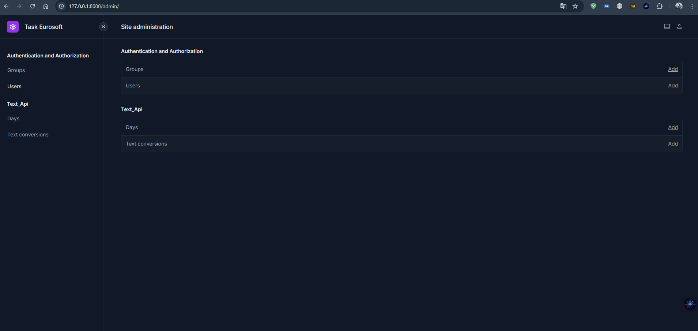

# Django REST Framework API Loyihasi

Bu loyiha Django REST Framework yordamida yaratilgan ikkita API ni o'z ichiga oladi:
1. **Tug'ilgan kunni hisoblash API** - Tug'ilgan sanadan boshlab bugungi kungacha bo'lgan kunlarni hisoblaydi.
2. **Matnni krill alifbosiga o'girish API** - Lotin tilidagi matnni krill alifbosiga o'giradi.

## Loyihani O'rnatish

1. **Loyihani klonlash**:
   ```bash
   git clone https://github.com/sizning-repo-manzilingiz.git
   cd task-eurosoft



django admin uchun yangi dizayin ishlatdim


Bu adminkani nomi unfold yaqinda chiqqan desamham boladi


projectga keladigan bolsak faqatgina 2 ta api chiqardim ikkalasiham post


korishingiz munkun


bu day yani kuni hisoblaydi 


bunisi esa lotin tilida kiritilgan sozlarni kirilcha qilib beradi